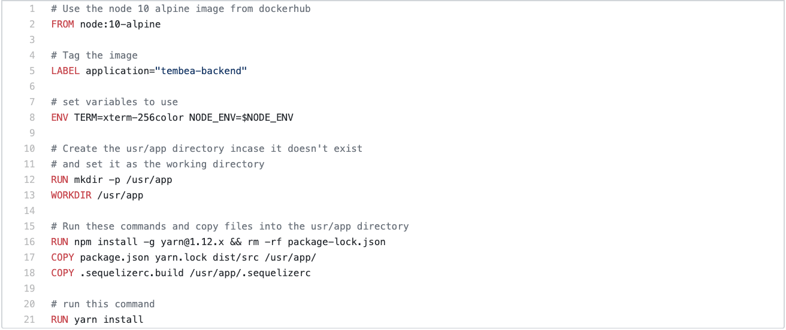
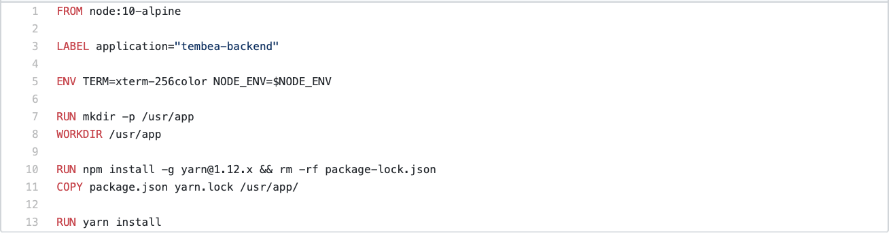
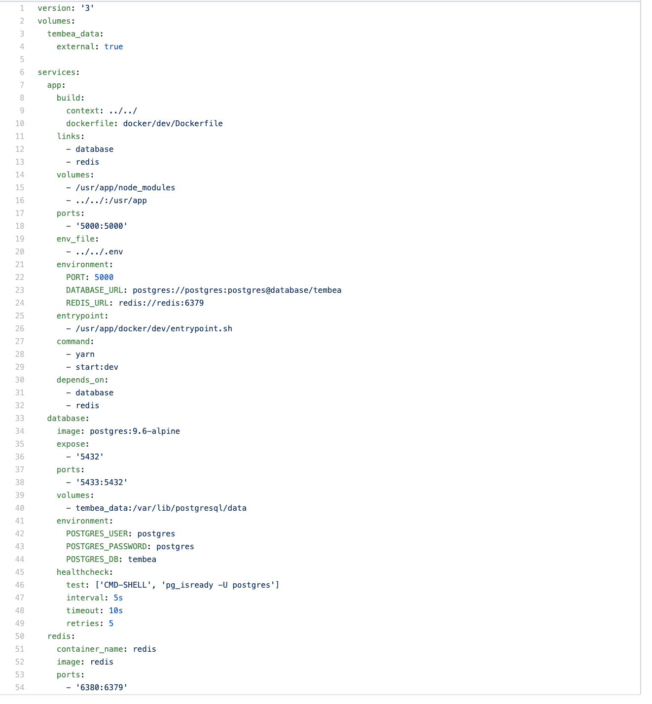
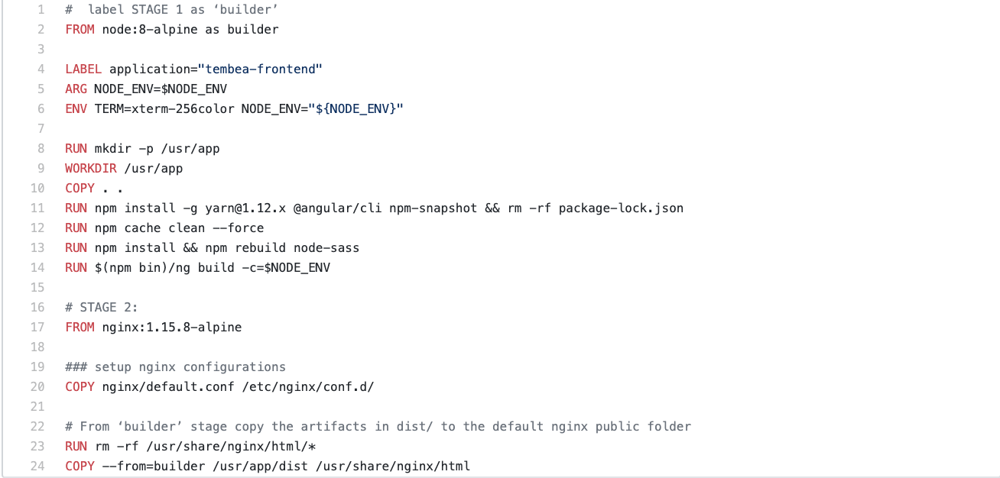

# Using Containers for Deployment
A simple README document demonstrating the use of containers for deployment

## Introduction
According to Docker(https://www.docker.com/resources/what-container) "A container is a standard unit of software that packages up code and all its dependencies so the application runs quickly and reliably from one computing environment to another."

Containers make it easy to build your applications in one environment and run them in other environments without having any issues. With containers, you can buid, test, ship and run your app on any platform with out having issues. Apps that are run using containers are said to have been containerized. Containerization is the process of bundling an app with all its dependencies, so that it can be run on several other platforms.

This README provides a brief description of the containerization of a The Tembea application by Andela.

## How containers work with applications
A container runs on a thin layer of virtualization engine that runs on the host OS of a physical or virtual machine. Containers are spun in issolated spaces like namespaces or CGROUPS. Each container bundles it's own binaries, and libraries, has it's own processes, and operating system. All the applications that are needed to run the containerized app can be installed inside the container and do not interfer with the applications or processes of thier host machine. Applications installed or run inside the containers stay in the container and are only accessible on the host machine if exposed.

Containers are basically instances of images. An image is a bundled piece of software that contains all the files and tools needed to run applications. Images are templates for containers because containers are created out of images. All the binaries and code inside images can be executed when a container is spun out of it.

This application is a react.js appliction which runs on node.js, so we use Docker as the containerization agent. We use a node-alpine image as the base image and provision our react app on that image. The end product is an image that contains our application and all that is required to run it. We use Dockerfiles for creating images. Our Dockerfile is present in the root directory of the project and contains commands for creating the image we need. When the image has been created, we run a container from that image and expose a port for the host machine to be able to access the running app.

This running container is completely isolated from other running containers and does not interfer with the processes in the host machine even though it shares an OS and a kernel with the machine.

## How containers work with the Tembea application
The tembea application is made up of a frontend and a backend, and both are containerized. A docker file is used to create an image that contains all the project files for each part and the container is spawn using the image.

### Backend
The deployment of the application begins from running jobs in Circleci. For deployment to staging or production, the Circleci script is set to use the Dockerfile in the release directory of the docker directory **(tembea/docker/release/Dockerfile)** where **tembea** is the root directory of the project. When this image is created, it is pushed to the Google Container Registry(GCR) where it is later used by kubernetes to spin up images for the application in production and staging.

For development, a docker compose file is used in **tembea/docker/dev/docker-compose.yml**. The docker compose file uses a Dockerfile in the same directory as itself to create an image for the backend app. It then uses a postgres image and a redis image to create services for a database and a redis cache. Each of these three services exposes ports so that they can communicate with each other.
#### Screenshot and link for the Dockerfile for production and staging
Link: https://github.com/andela/tembea/blob/develop/docker/release/Dockerfile

#### Screenshots and link for the Dockerfile for development
Link: https://github.com/andela/tembea/blob/develop/docker/dev/Dockerfile

#### Screenshot and link for the docker-compose-file for development
Link: https://github.com/andela/tembea/blob/develop/docker/dev/docker-compose.yml

### Frontend
The Tembea frontend application uses a Dockerfile for creating an image for it's container. The dockerfile executes commands that use the code of the application to create the image. Just like the backend, the created image is pushed to the Google Container Registry(GCR) and then used by kubernetes to spin up containers to run the app.

#### Screenshot and link for the the Dockerfile for the frontend application
Link: https://github.com/andela/tembea-frontend/blob/develop/docker/release/Dockerfile

## URL to containerized application
Frontend: https://tembea.andela.com/

Backend: https://tembea-prod-api.andela.com/
